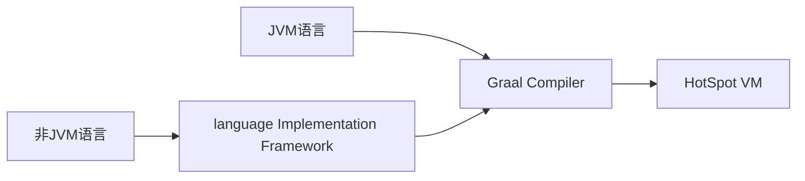

### 简介

GraalVM是Oracle推出的高性能JVM，旨在加速Java和其他JVM语言程序执行。

GraalVM还是一种通用虚拟机，同时支持了C、C++、Rust、R、Ruby、Python、Scala、JS等。和其他JVM实现不同在于，不仅仅能运行JVM语言。通过将其他语言的源码或中间格式，转换成Graal接受的中间格式，实现了多语言编译运行。

譬如设计一个解释器（[Sulong](https://link.zhihu.com/?target=https%3A//github.com/oracle/graal/tree/master/sulong)）专门对LLVM输出的字节码进行转换来支持C语言。官方还开放了一个Java实现的truffle工具集，来构建面向一种新语言的解释器。

如果抛开多语言框架，GraalVM可以看作一个C2编译器被替换成Graal的HotSpot。瞬间明了。

从性能测试看，Graal和HotSpot的C2大体性能差不多，没有碾压式突破。

如果还是运行class文件，GraalVM看上去没有“那么”有吸引力，不是非用不可。

对于脚本语言来说很有吸引力，直接把解释执行变成了编译执行，性能可以大幅提升。并且不同语言对GraalVM运行时来说没有区别，支持多语言的互相调用。

### Native Image

原有的JIT方案看似接近极限了，要不然直接编译运行算了。

Native Image就是GraalVM提供一个新的Java执行方式，把Java源码直接编译成二进制执行文件，无需预热，一步到位。当然代价就是不能run anywhere了。

这种方式，或许是比较适合serverless，运行环境是预设好了的，且无法提供JIT预热的时间条件。

参考：

https://zhuanlan.zhihu.com/p/137836206

https://www.graalvm.org/docs/introduction/
